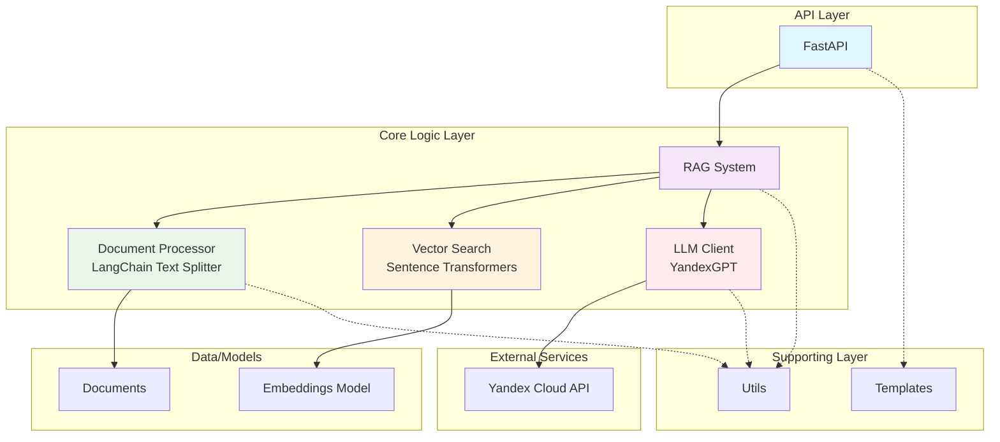
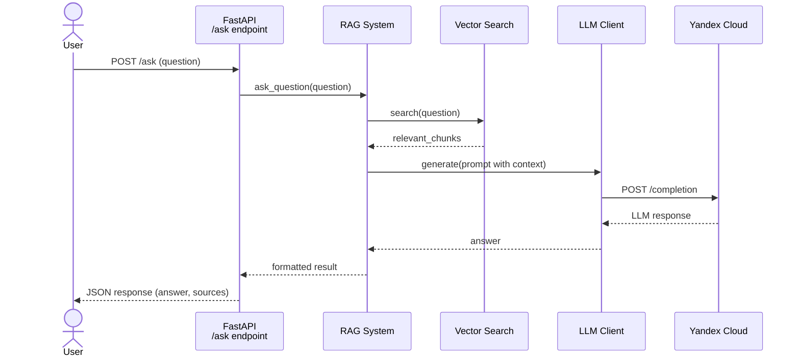
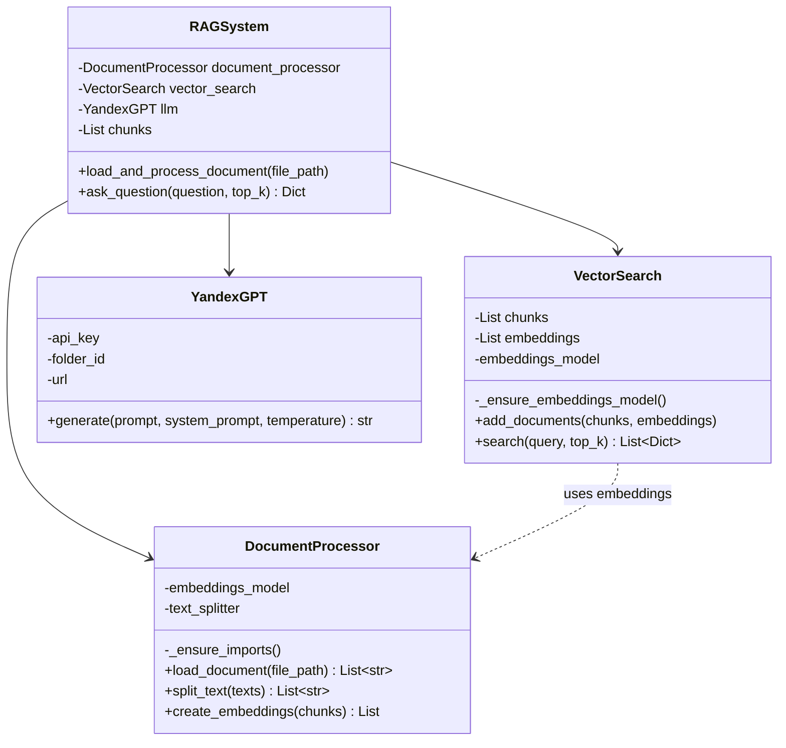

# RAG demo

deployed: https://ra-ra.onrender.com/ui

## Architecture

```mermaid
graph TB
    subgraph "External Services"
        YC[Yandex Cloud API]
    end

    subgraph "API Layer"
        API[FastAPI]
    end

    subgraph "Core Logic Layer"
        RS[RAG System]
        DP[Document Processor<br/>LangChain Text Splitter]
        VS[Vector Search<br/>Sentence Transformers]
        LLM[LLM Client<br/>YandexGPT]
    end

    subgraph "Supporting Layer"
        UTILS[Utils]
        TEMP[Templates]
    end

    subgraph "Data/Models"
        DOCS[Documents]
        VEC[Embeddings Model]
    end

    API --> RS
    RS --> DP
    RS --> VS
    RS --> LLM
    DP --> DOCS
    VS --> VEC
    LLM --> YC

    RS -.-> UTILS
    DP -.-> UTILS
    LLM -.-> UTILS
    API -.-> TEMP

    style API fill:#e1f5fe
    style RS fill:#f3e5f5
    style DP fill:#e8f5e8
    style VS fill:#fff3e0
    style LLM fill:#ffebee
```

## Workflow: Question Answering

```mermaid
sequenceDiagram
    actor User
    participant API as FastAPI<br/>/ask endpoint
    participant RS as RAG System
    participant VS as Vector Search
    participant LLM as LLM Client
    participant YC as Yandex Cloud

    User->>API: POST /ask (question)
    API->>RS: ask_question(question)
    RS->>VS: search(question)
    VS-->>RS: relevant_chunks
    RS->>LLM: generate(prompt with context)
    LLM->>YC: POST /completion
    YC-->>LLM: LLM response
    LLM-->>RS: answer
    RS-->>API: formatted result
    API-->>User: JSON response (answer, sources)
```

## Core Classes

```mermaid
classDiagram
    class RAGSystem {
        -DocumentProcessor document_processor
        -VectorSearch vector_search
        -YandexGPT llm
        -List chunks
        +load_and_process_document(file_path)
        +ask_question(question, top_k) Dict
    }

    class DocumentProcessor {
        -embeddings_model
        -text_splitter
        -_ensure_imports()
        +load_document(file_path) List~str~
        +split_text(texts) List~str~
        +create_embeddings(chunks) List
    }

    class VectorSearch {
        -List chunks
        -List embeddings
        -embeddings_model
        -_ensure_embeddings_model()
        +add_documents(chunks, embeddings)
        +search(query, top_k) List~Dict~
    }

    class YandexGPT {
        -api_key
        -folder_id
        -url
        +generate(prompt, system_prompt, temperature) str
    }

    RAGSystem --> DocumentProcessor
    RAGSystem --> VectorSearch
    RAGSystem --> YandexGPT
    VectorSearch ..> DocumentProcessor : uses embeddings
```
